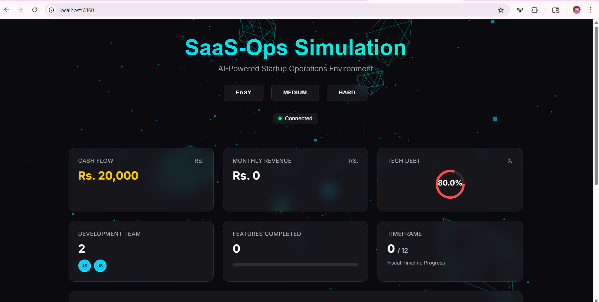
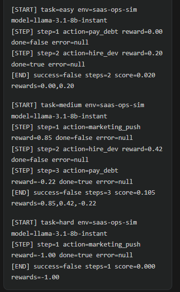

# 🚀 SaaS-Ops OpenEnv Simulation

A B2B SaaS operations simulator built for the OpenEnv specification. An AI agent acts as the startup COO — balancing feature development, marketing investment, and technical debt across three increasingly difficult scenarios.

This project includes a **FastAPI backend** that provides a Farama-gym style environment via REST API and a **stunning Glassmorphic UI** to visualize the simulation in real-time.

---

## 🏗️ Architecture

```text
SaaS-Ops-OpenEnv-Simulation/
├── core.py            # Simulation engine — state management, math, and stochastic events
├── models.py          # Pydantic schemas — Action and Observation models
├── tasks.py           # Task graders — Level-specific logic (Easy, Medium, Hard)
├── server/app.py      # FastAPI application — API endpoints and static file serving
├── index.html         # Modern UI dashboard (Glassmorphism + Three.js)
├── baseline_agent.py  # LLM-powered baseline (Claude/Groq supported)
├── mock_agent.py      # Random action agent for smoke-testing
├── openenv.yaml       # OpenEnv manifest for multi-agent frameworks
├── requirements.txt   # Python dependencies
└── Dockerfile         # Optimized container definition for Hugging Face Spaces
```

---

## 🕹️ Environment Specification

### 📥 Observation Space
The environment provides a JSON object containing the current health of the startup:

| Field | Type | Description |
| :--- | :--- | :--- |
| `cash` | `float` | Current cash balance in Rs. |
| `devs` | `int` | Number of active full-time developers. |
| `features_completed`| `int` | Cumulative number of pivot features shipped. |
| `monthly_revenue` | `float` | Current Monthly Recurring Revenue (MRR). |
| `tech_debt` | `float` | Tech debt score (0.0 to 1.0). High debt kills productivity. |
| `tech_debt_details` | `object`| Rich context for LLMs: `{reasoning, impact, recommendation}`. |
| `current_month` | `int` | Simulation step (1-12). |
| `is_bankrupt` | `bool` | Terminal flag if cash hits zero. |
| `event_message` | `str` | Description of any stochastic event triggered this month. |

### 📤 Action Space
Agents must submit one action per month:

| Action Type | Parameters | Description |
| :--- | :--- | :--- |
| `hire_dev` | `count: int` | Hire 1-5 developers. Upfront cost + monthly salary. |
| `pay_debt` | `amount: float`| Invest cash to refactor code and reduce tech debt. |
| `marketing_push` | `amount: float`| Spend on ads/sales to boost MRR temporarily. |

---

## 🏆 Simulation Tasks

| Level | Goal | Initial State |
| :--- | :--- | :--- |
| **Easy** | Clean up Tech Debt | Rs. 20k, 80% Debt, 2 Devs. Goal: Debt ≤ 40%. |
| **Medium** | Growth & Revenue | Rs. 50k, 10% Debt, 1 Dev. Goal: Rs. 10k MRR. |
| **Hard** | Survival (The Pivot) | Rs. 30k, 40% Debt, 3 Devs. Goal: 12 Pivots + 1yr survival. |

---

## 🎲 Stochastic Events (15% Prob/Month)
Real-world chaos included:
- **Key Dev Quits**: -1 Dev, +5% Tech Debt.
- **Viral Spike**: +Rs. 3k Revenue, +3% Load Debt.
- **Server Outage**: -Rs. 2k Cash, -Rs. 1.5k Revenue.
- **Investor Interest**: Capital injection (+Rs. 5k).
- **Bug Flood**: -Rs. 2k Revenue, +8% Debt.

---

## 🛠️ Setup & Running Locally

### 1. Installation
```bash
git clone https://github.com/your-username/SaaS-Ops-OpenEnv-Simulation.git
cd SaaS-Ops-OpenEnv-Simulation
pip install -r requirements.txt
```

### 2. Start the Environment
```bash
uvicorn server.app:app --host 0.0.0.0 --port 7860 --reload
```
- **Dashboard**: Open `http://localhost:7860` in your browser.
- **API Docs**: Visit `http://localhost:7860/docs`.

### 3. Run Agents
**Smoke Test (Random):**
```bash
python mock_agent.py
```

**LLM Baseline (requires API key):**
```bash
# Set your environment variable
export GROQ_API_KEY=your_key_here
python baseline_agent.py
```

---

## 🐳 Docker & Hugging Face Deployment

This repository is pre-configured for **Hugging Face Spaces** using the Docker SDK.

**Local Docker Build:**
```bash
docker build -t saas-ops-sim .
docker run -p 7860:7860 saas-ops-sim
```

To deploy on Hugging Face:
1. Create a new **Space** on HF.
2. Select **Docker** as the SDK.
3. Push your code to the Space's repository.
4. The simulation will automatically build and serve the UI at the Space URL.

---

## 🔌 API Reference

| Endpoint | Method | Params | Description |
| :--- | :--- | :--- | :--- |
| `/` | `GET` | — | Serves the interactive UI dashboard. |
| `/reset` | `POST` | `task_level: str` | Resets environment (easy/medium/hard). |
| `/step` | `POST` | `Action` JSON | Advances simulation by one month. |
| `/state` | `GET` | — | Returns current observation JSON. |

---

## 📸 Screenshots


*Modern Glassmorphic Dashboard showcasing simulation state.*


*AI Agent successfully navigating the 'Hard' task level.*

---

